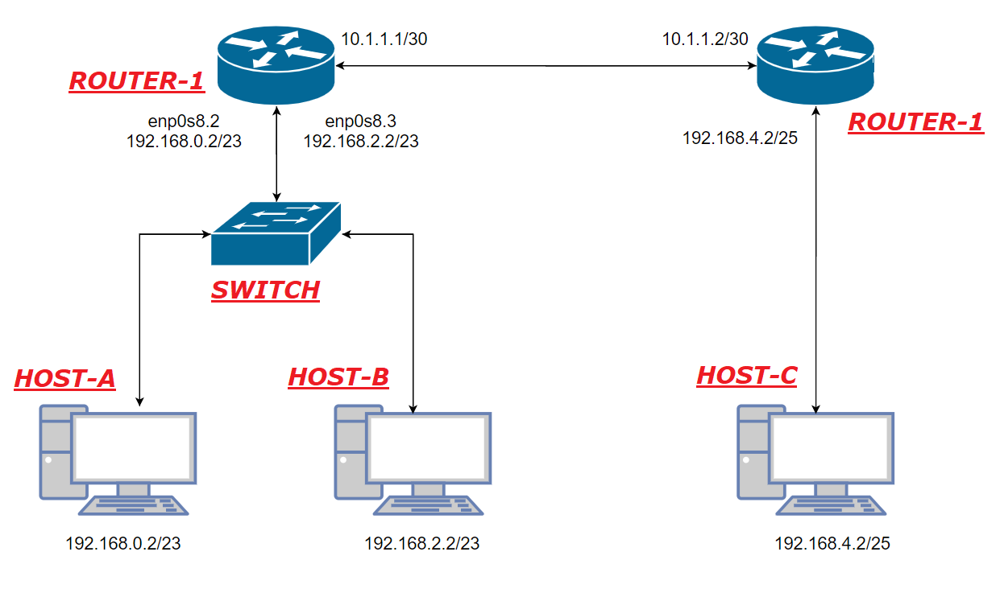

# DNCS-LAB

This repository contains the Vagrant files required to run the virtual lab environment used in the DNCS course.
```


        +-----------------------------------------------------+
        |                                                     |
        |                                                     |eth0
        +--+--+                +------------+             +------------+
        |     |                |            |             |            |
        |     |            eth0|            |eth2     eth2|            |
        |     +----------------+  router-1  +-------------+  router-2  |
        |     |                |            |             |            |
        |     |                |            |             |            |
        |  M  |                +------------+             +------------+
        |  A  |                      |eth1                       |eth1
        |  N  |                      |                           |
        |  A  |                      |                           |
        |  G  |                      |                     +-----+----+
        |  E  |                      |eth1                 |          |
        |  M  |            +-------------------+           |          |
        |  E  |        eth0|                   |           |  host-c  |
        |  N  +------------+      SWITCH       |           |          |
        |  T  |            |                   |           |          |
        |     |            +-------------------+           +----------+
        |  V  |               |eth2         |eth3                |eth0
        |  A  |               |             |                    |
        |  G  |               |             |                    |
        |  R  |               |eth1         |eth1                |
        |  A  |        +----------+     +----------+             |
        |  N  |        |          |     |          |             |
        |  T  |    eth0|          |     |          |             |
        |     +--------+  host-a  |     |  host-b  |             |
        |     |        |          |     |          |             |
        |     |        |          |     |          |             |
        ++-+--+        +----------+     +----------+             |
        | |                              |eth0                   |
        | |                              |                       |
        | +------------------------------+                       |
        |                                                        |
        |                                                        |
        +--------------------------------------------------------+


```

# Requirements
 - Python 3
 - 10GB disk storage
 - 2GB free RAM
 - Virtualbox
 - Vagrant (https://www.vagrantup.com)
 - Internet

# How-to
 - Install Virtualbox and Vagrant
 - Clone this repository
`git clone https://github.com/fabrizio-granelli/dncs-lab`
 - You should be able to launch the lab from within the cloned repo folder.
```
cd dncs-lab
[~/dncs-lab] vagrant up
```
Once you launch the vagrant script, it may take a while for the entire topology to become available.
 - Verify the status of the 4 VMs
 ```
 [dncs-lab]$ vagrant status                                                                                                                                                                
Current machine states:

router                    running (virtualbox)
switch                    running (virtualbox)
host-a                    running (virtualbox)
host-b                    running (virtualbox)
```
- Once all the VMs are running verify you can log into all of them:
`vagrant ssh router`
`vagrant ssh switch`
`vagrant ssh host-a`
`vagrant ssh host-b`
`vagrant ssh host-c`

# Assignment
This section describes the assignment, its requirements and the tasks the student has to complete.
The assignment consists in a simple piece of design work that students have to carry out to satisfy the requirements described below.
The assignment deliverable consists of a Github repository containing:
- the code necessary for the infrastructure to be replicated and instantiated
- an updated README.md file where design decisions and experimental results are illustrated
- an updated answers.yml file containing the details of your project

## Design Requirements
- Hosts 1-a and 1-b are in two subnets (*Hosts-A* and *Hosts-B*) that must be able to scale up to respectively {{ HostsASubnetRequiredAddresses }} and {{ HostsBSubnetRequiredAddresses }} usable addresses
- Host 2-c is in a subnet (*Hub*) that needs to accommodate up to {{ HubSubnetRequiredAddresses }} usable addresses
- Host 2-c must run a docker image (dustnic82/nginx-test) which implements a web-server that must be reachable from Host-1-a and Host-1-b
- No dynamic routing can be used
- Routes must be as generic as possible
- The lab setup must be portable and executed just by launching the `vagrant up` command

## Tasks
- Fork the Github repository: https://github.com/fabrizio-granelli/dncs-lab
- Clone the repository
- Run the initiator script (dncs-init). The script generates a custom `answers.yml` file and updates the Readme.md file with specific details automatically generated by the script itself.
  This can be done just once in case the work is being carried out by a group of (<=2) engineers, using the name of the 'squad lead'. 
- Implement the design by integrating the necessary commands into the VM startup scripts (create more if necessary)
- Modify the Vagrantfile (if necessary)
- Document the design by expanding this readme file
- Fill the `answers.yml` file where required (make sure that is committed and pushed to your repository)
- Commit the changes and push to your own repository
- Notify the examiner (fabrizio.granelli@unitn.it) that work is complete specifying the Github repository, First Name, Last Name and Matriculation number. This needs to happen at least 7 days prior an exam registration date.

# Notes and References
- https://rogerdudler.github.io/git-guide/
- http://therandomsecurityguy.com/openvswitch-cheat-sheet/
- https://www.cyberciti.biz/faq/howto-linux-configuring-default-route-with-ipcommand/
- https://www.vagrantup.com/intro/getting-started/


# Design

## Network requirements
- 467 adresses for Host-A
- 393 addresses for host-B
- 126 addresses for host-C
- Host-C running a Docker image reachable by host-A and host-B
- Using only static routes as generic as possible

## Subnetting
- For Host-A we need 467 hosts, so we use 9 bits out of 32 (IPv4 bits) for the hosts part. We obtain a total of 512-2=510 possible host addresses. I've choosen for this subnet the address 192.168.0.0 /23.
- For Host-B we need 393 hosts, so we use 9 bits out of 32 (IPv4 bits) for the hosts part. We obtain a total of 512-2=510 possible host addresses. I've choosen for this subnet the address 192.168.2.0 /23.
- For Host-C we need 126 hosts, so we use 7 bits out of 32 (IPv4 bits) for the hosts part. We obtain a total of 128-2=126 possible host addresses. I've choosen for this subnet the address 192.168.4.0 /25.

## Network topology


## IP and physical ports configuration
In this topology we have a switch directly connected to two networks. Because of that,  we need to create two VLANs in order to split the traffic to the right hosts. Also we need to create an encapsulation of two ports on router-1, and these will be the VLANs gateways. (We're creating two ports over one physical port).

#### Router 1
```
10.1.1.1/30 enp0s9        (Link between the two routers)
192.168.0.1/23 enp0s8.2   (Gateway for VLAN 2 [Host-A])
192.168.2.1/23 enp0s8.3   (Gateway for VLAN 3 [Host-B])
```
#### Router 2
```
10.1.1.2/30 enp0s9        (Link between the two routers)
192.168.4.1/25 enp0s8     (Gateway for host-C)
```
#### Host-A
```
192.168.0.2/23 enp0s8     (Host-A IP address)
```
#### Host-B
```
192.168.2.2/23 enp0s8     (Host-B IP address)
```
#### Host-C
```
192.168.4.2/25 enp0s8     (Host-C IP address)
```

## Files and devices configuration
### Vagrant file
First of all, we need to reconfigure the ` Vagrantfile ` file. What we need to do is to change some lines of this file. In particular we need to change the path for every device from ` common.sh ` to ` [deviceName].sh `.
We need also to increase the memory of Host-C from 256 to 512 to run a Docker image.

##### Router 1
```
router1.vm.provision "shell", path: "common.sh" ---> router1.vm.provision "shell", path: "router-1.sh"
```
##### Router 2
```
router2.vm.provision "shell", path: "common.sh"  ---> router2.vm.provision "shell", path: "router-2.sh" 
```
##### Switch
```
switch.vm.provision "shell", path: "common.sh" ---> switch.vm.provision "shell", path: "switch.sh" 
```
##### Host-A
```
hosta.vm.provision "shell", path: "common.sh" ---> hosta.vm.provision "shell", path: "host-a.sh"
```
##### Host-B
```
hostb.vm.provision "shell", path: "common.sh" ---> hostb.vm.provision "shell", path: "host-b.sh"
```
##### Host-C
```
hostc.vm.provision "shell", path: "common.sh" ---> hostc.vm.provision "shell", path: "host-c.sh"
vb.memory = 256 ---> vb.memory = 512
```
### Router-1
Router-1 must be connected to the switch and router-2 to grant the connection between all the networks of our topology (host-A and host-B networks connected to host-C network) and also to grant the perfect behavior of VLAN-2 and VLAN-3, that use an encapsulated port of router-1 as gateway.
Also we need to create a static route, to grant the connectivity between host-A and host-B networks and host-C network. In particular we need to specify that packets whose destination is the host-C network must be sent to the router-2.
To do this we open the ` router-1.sh ` file and type as follow:
```
export DEBIAN_FRONTEND=noninteractive
sudo sysctl -w net.ipv4.ip_forward=1
sudo ip link add link enp0s8 name enp0s8.2 type vlan id 2   (add an encapsulated port enp0s8.2 for the VLAN-2)
sudo ip link add link enp0s8 name enp0s8.3 type vlan id 3   (add an encapsulated port enp0s8.3 for the VLAN-3)
sudo ip addr add 192.168.0.1/23 dev enp0s8.2                (set the IP of enp0s8.2 port)
sudo ip addr add 192.168.2.1/23 dev enp0s8.3                (set the IP of enp0s8.3 port)
sudo ip addr add 10.1.1.1/30 dev enp0s9                     (set the IP of the port enp0s9 [link between routers])
sudo ip link set dev enp0s8 up                              (activating enp0s8 port)
sudo ip link set dev enp0s9 up                              (activating enp0s9 port)
sudo ip route add 192.168.4.0/25 via 10.1.1.2               (static route to host-C network [192.168.4.0/25])
```

### Router-2
Router-2 must be connected to host-C network and router-1 to grant the connection between all the networks of our topology (host-C network connected to host-A and host-B networks).
Also we need to create a static routes, in order to grant the connectivity between host-C network connected to host-A and host-B networks. In particular we need to specify that packets whose destination is the host-A or host-B network must be sent to the router-2.
To do this we open the ` router-2.sh ` file and type as follow:
```
export DEBIAN_FRONTEND=noninteractive
sudo sysctl -w net.ipv4.ip_forward=1
sudo ip addr add 192.168.4.1/25 dev enp0s8                  (set the IP of the port enp0s8 [host-C network gateway])
sudo ip addr add 10.1.1.2/30 dev enp0s9                     (set the IP of the port enp0s9 [link between routers])
sudo ip link set dev enp0s8 up                              (activating enp0s8 port)
sudo ip link set dev enp0s9 up                              (activating enp0s9 port)
sudo ip route add 192.168.2.0/23 via 10.1.1.1               (static route to host-B network [192.168.2.0/23])
sudo ip route add 192.168.0.0/23 via 10.1.1.1               (static route to host-A network [192.168.0.0/23])
```

### Switch
The switch must be connected to the router-1 and to the host-A and host-B networks (with the VLAN 2 and VLAN 3 respectively). To do this we need to open the file ` switch.sh ` and insert some lines as shown:
```
export DEBIAN_FRONTEND=noninteractive
apt-get update
apt-get install -y tcpdump
apt-get install -y openvswitch-common openvswitch-switch apt-transport-https ca-certificates curl software-properties-common

sudo ovs-vsctl add-br switch
sudo ovs-vsctl add-port switch enp0s8            (adding the port connected to router-1)
sudo ovs-vsctl add-port switch enp0s9 tag="2"    (adding the port dedicated to VLAN-2)
sudo ovs-vsctl add-port switch enp0s10 tag="3"   (adding the port dedicated to VLAN-3)
sudo ip link set dev enp0s8 up                   (activating enp0s8 port)
sudo ip link set dev enp0s9 up                   (activating enp0s9 port)
sudo ip link set dev enp0s10 up                  (activating enp0s10 port)
```

### Host-A
Host-A in our topology is connected to the switch and must contain static routes in order to send the packages to the correct IP (host-C must know how to reach host-A and host-B networks). To do that we need to open the `file host-a.sh ` and complete it as follow:
```
export DEBIAN_FRONTEND=noninteractive
sudo ip addr add 192.168.0.2/23 dev enp0s8          (set the IP of enp0s8 port [host-A])
sudo ip link set dev enp0s8 up                      (activating enp0s8 port)
sudo ip route add 192.168.4.0/25 via 192.168.0.1    (static route to host-C network [192.168.4.0/25])
sudo ip route add 192.168.2.0/23 via 192.168.0.1    (static route to host-B network [192.168.2.0/23])
```

### Host-B
Host-B in our topology is connected to the switch and must contain static routes in order to send the packages to the correct IP (host-B must know how to reach host-A and host-C networks). To do that we need to open the `file host-a.sh ` and complete it as follow:
```
export DEBIAN_FRONTEND=noninteractive
sudo ip addr add 192.168.2.2/23 dev enp0s8         (set the IP of enp0s8 port [host-B])
sudo ip link set dev enp0s8 up                     (activating enp0s8 port)
sudo ip route add 192.168.0.0/23 via 192.168.2.1   (static route to host-A network [192.168.0.0/23])
sudo ip route add 192.168.4.0/25 via 192.168.2.1   (static route to host-C network [192.168.4.0/25])
```

### Host-C
Host-C in our topology is connected to router-2 and must contain static routes in order to send the packages to the correct IP (host-A must know how to reach host-B and host-C networks).
Also host-C must run the ` dustnic82 / nginx-test ` Docker image, so we need to install ` docker.io `  and run that Docker image.
To do that we need to open the file ` host-a.sh ` and complete it as follow:
```
export DEBIAN_FRONTEND=noninteractive
sudo apt-get update
sudo apt -y install docker.io                                   (Docker installation and startup)
sudo systemctl start docker
sudo systemctl enable docker
sudo docker pull dustnic82/nginx-test                           (pull and open of "dustnic82 / nginx-test")
sudo docker run --name nginx -p 80:80 -d dustnic82/nginx-test   
sudo ip addr add 192.168.4.2/25 dev enp0s8                      (set the IP of enp0s8 port [host-C])
sudo ip link set dev enp0s8 up                                  (activating enp0s8 port)
sudo ip route add 192.168.0.0/23 via 192.168.4.1                (static route to host-A network [192.168.0.0/23])
sudo ip route add 192.168.2.0/23 via 192.168.4.1                (static route to host-B network [192.168.2.0/23])
```

# Test and conclusions
To test the behavior of our network we need to run the ` vagrant up ` command into our ` dncs-lab ` directory, wait a little bit, and after the startup log into each host with the command ` vagrant ssh [hostname] ` and try to ping the other ones, with the command ` ping [hostname] `.
When we log into host-A and/or host-B we can test our Docker image on the host-C with the ` curl 192.168.4.2 ` command.
With this command the result should be as follow:
```
<!DOCTYPE html>
<html>
<head>
<title>Hello World</title>
<link href="data:image/png;base64,iVBORw0KGgoAAAANSUhEUgAAAEAAAABACAYAAACqaXHeAAAGPElEQVR42u1bDUyUdRj/iwpolMlcbZqtXFnNsuSCez/OIMg1V7SFONuaU8P1MWy1lcPUyhK1uVbKcXfvy6GikTGKCmpEyoejJipouUBcgsinhwUKKKJ8PD3vnzsxuLv35Q644+Ue9mwH3P3f5/d7n6/3/3+OEJ/4xCc+8YQYtQuJwB0kIp+JrzUTB7iJuweBf4baTlJ5oCqw11C/JHp+tnqBb1ngT4z8WgReTUGbWCBGq0qvKRFcHf4eT/ZFBKoLvMBGIbhiYkaQIjcAfLAK+D8z9YhjxMgsVUGc84+gyx9AYD0khXcMfLCmUBL68HMZ+PnHxyFw3Uwi8B8hgJYh7j4c7c8PV5CEbUTUzBoHcU78iIl/FYFXWmPaNeC3q4mz5YcqJPI1JGKql2Z3hkcjD5EUznmcu6qiNT+Y2CPEoH3Wm4A/QERWQFe9QQ0caeCDlSZJrht1HxG0D3sOuCEiCA1aj4ZY3Ipzl8LiVtn8hxi5zRgWM8YYPBODF/9zxOLcVRVs+YGtwFzxCs1Bo9y+avBiOTQeUzwI3F5+kOwxsXkkmWNHHrjUokqtqtSyysW5gUHV4mtmZEHSdRkl+aELvcFIRN397gPPXD4ZgbxJW1S5OJdA60MgUAyHu1KfAz+pfCUtwr+HuQc8ORQ1jK4ZgGsTvcY5uQP5oYkY2HfcK5sGLpS6l1xZQwNn7Xkedp3OgMrWC1DX0Qwnms/A1rK9cF9atNVo18DP/3o5fF99BGo7LFDRWgMJJQaYQv/PyOcHySP0TITrBIhYb+WSHLrlNGEx5NeXgj2paW8C5rs46h3Dc3kt3G2Ogr9aqoes+f5RvbL1aJ5iXnKnxkfIEoB3N/zHeHAmF9ovwryvYvC9TysnICkEonPX212vvOU8+As6eS+QCDAw0aNLABq6LO8DkJMSSznMMEfScFFGwCJYXbDV7lq17RYIQu+QTYpjRUBM3gZQIt+cOwyTpWRpYBQRsKrgU4ceNS4JkCSxLI1+ZsIS0NvXB6sLE/tL5EQkQJKOm52YON9y7glqJkCSOqzrD6Uvc1wZ1EBA07V/IafmN4ckHG+ugJkSEHuVQQ0ENFy9BLP3R0NR4ymHJGRWFWBnZ6fPVwMBF9EDgrD2z0USqtoaHJKw49SBoZ2dWggIxmcEsvspYLLi4PKNDrvv68OfuKLt/68MqiJAan4Q0IpDm6G7r8fue692X4fI7PiByqA6AqygNh0XHIaClDOkpz9aGVRJABo8CTP+3sqfHZJQeqkSgvHZn+xaqEICKAlhECSGO60MWdVF4IcesDL/ExUSYN3okCrD31fqHZLwcWkq5owPVUoA3UcIgdBv10BrV7vdz3b39kBhw0kVE2BNirG/bqRghyPqIcBKQkKJcVgE1LQ1wR3S5ooqCDBKlSEUzGdyFBNwvq1RTQT0b4BOF5+BgoayCUqAtTLMSXsRzl6uHX8EONoUtXS2KCfAusOsyVwFLV1tznNAuzflAGxb+R/esGuodDcD0bUVbYLelhRf/mWD08ogdYtTjNwYbIsrORhBIwJMPOTWHh1i6Lriz107FUKviivcZvfp8WZvN8TmbVS2rtsHI8mMtn9gSe50KAz79yWw8490OGYpp8lsTUGictd3EA6PHVwB20+mYUNURo/aMs4dhqjsdcoOWGxH5yYu0g0P0EzFBd7DxZoVHY7aHmWtB6VunwhLB6P0gFULk6zhJnvnBw5HW9D9N5GkpQEjMBcQOg+JMBNxjMZgHISawvGZHiKw+0mybv5ozP0txgvk07AQvWxAoh98sXsur3RmwMStxIud9fiIzMAIXTV6yNqxHaH7gg1GA7bgxVvHfEjq1hAl10ZM/A46gO0x0bOPoiHpSEDvsMZhXVVbVRL4TLz2E140EK1dgsnnd9mBaHcmwuigJHeCGLkXvHNaNHOBP4J/HYmoGbGwsJU1ka0nAvM2ht40758ZNmvvRRJ24l3roMa7MxVq4jpRdyMRc8bh9wR0TyIRWdR9hzNXaJs3Ftif6KDWuBcBH0hErky2bNraV5E9jcBjiapE1ExHkO8iEY1OvjLTjAkugezh7ySqFUPoXHTtZAR7ncY4rRrYYgtcCtGHPUgmjEhPmiKXjXc/l4g6HfGJT3ziEw/If86JzB/YMku9AAAAAElFTkSuQmCC" rel="icon" type="image/png" />
<style>
body {
  margin: 0px;
  font: 20px 'RobotoRegular', Arial, sans-serif;
  font-weight: 100;
  height: 100%;
  color: #0f1419;
}
div.info {
  display: table;
  background: #e8eaec;
  padding: 20px 20px 20px 20px;
  border: 1px dashed black;
  border-radius: 10px;
  margin: 0px auto auto auto;
}
div.info p {
    display: table-row;
    margin: 5px auto auto auto;
}
div.info p span {
    display: table-cell;
    padding: 10px;
}
img {
    width: 176px;
    margin: 36px auto 36px auto;
    display:block;
}
div.smaller p span {
    color: #3D5266;
}
h1, h2 {
  font-weight: 100;
}
div.check {
    padding: 0px 0px 0px 0px;
    display: table;
    margin: 36px auto auto auto;
    font: 12px 'RobotoRegular', Arial, sans-serif;
}
#footer {
    position: fixed;
    bottom: 36px;
    width: 100%;
}
#center {
    width: 400px;
    margin: 0 auto;
    font: 12px Courier;
}

</style>
<script>
var ref;
function checkRefresh(){
    if (document.cookie == "refresh=1") {
        document.getElementById("check").checked = true;
        ref = setTimeout(function(){location.reload();}, 1000);
    } else {
    }
}
function changeCookie() {
    if (document.getElementById("check").checked) {
        document.cookie = "refresh=1";
        ref = setTimeout(function(){location.reload();}, 1000);
    } else {
        document.cookie = "refresh=0";
        clearTimeout(ref);
    }
}
</script>
</head>
<body onload="checkRefresh();">

<div class="info">
<p><span>Server&nbsp;address:</span> <span>172.17.0.2:80</span></p>
<p><span>Server&nbsp;name:</span> <span>31ac70a30914</span></p>
<p class="smaller"><span>Date:</span> <span>16/Jan/2021:23:36:01 +0000</span></p>
<p class="smaller"><span>URI:</span> <span>/</span></p>
</div>
<br>
<div class="info">
    <p class="smaller"><span>Host:</span> <span>192.168.0.2</span></p>
    <p class="smaller"><span>X-Forwarded-For:</span> <span></span></p>
</div>

<div class="check"><input type="checkbox" id="check" onchange="changeCookie()"> Auto Refresh</div>
    <div id="footer">
        <div id="center" align="center">
            Request ID: a2643e5f70e248c000aaa0492a61d9b4<br/>
            &copy; NGINX, Inc. 2018
        </div>
    </div>
</body>
</html>
```


